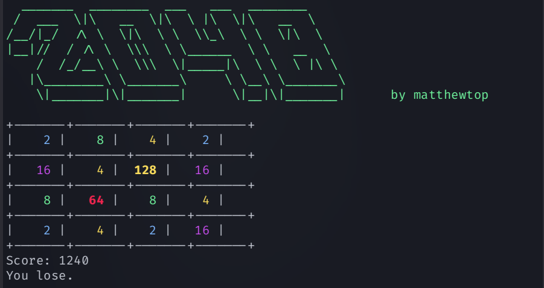

# 2048

This project is a terminal-based implementation of the popular game 2048. Use 'WSAD' to move numbers and 'Q' to quit the game.




## Installation

Clone the repository:

```bash
  git clone https://github.com/matthewtop/C2048.git
```

Go to repository location and compile the C file:

```bash
  cd C2048/
```
```bash
  gcc -o game game.c
```

Run and enjoy the game:

```bash
  ./game
```
    